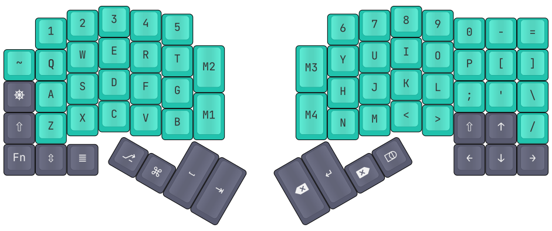

# ErgoNICE

An open source 69-key column-staggered split mechanical keyboard with a rotary knob, extra connectors, a 3D printed case with "floating key" (borderless) design, and Rusty firmware.

## Layout

(labels on the picture are the *physical* layout, I use [Colemak](https://colemak.com/))

- Designed in [KLE](http://www.keyboard-layout-editor.com/), the file is `layout.jsonl`;
- I stared with the [Ergodox](https://www.ergodox.io/) layout,
- threw away its surroundings leaving only the "core",
- added an ortholinear "familiarity cluster" on the right for punctuation and especially non-English layouts,
- and arranged thumb clusters and other keys in a way that made sense for *me*.

## PCB

- Designed in [Horizon EDA](https://horizon-eda.org/), the project is in the `pcb-ergonice` directory;
- The left side is designed for automated SMT assembly, the right side is designed for manual TH soldering at home;
- Various protections are included, even reverse polarity via transistors;
- Uses an STM32L151C8 microcontroller (since the L series were less affected by the chip shortage);
- Uses an MCP23017 I/O expander on the right side (DIP package, even — because I had 5 of those on hand since the early days of Arduino and had to use them);
- Uses a TYPE-C-31-M-12 USB-C connector, does the Type C legacy device resistor thing correctly;
- Uses PJ313B 3.5mm jack TRRS connectors for the cable between the halves:
	- note that actually the "extra" protruding part of the connector must be cut off — who designed this one >_<;
- Uses a Bourns PEC12R (or a clone called EC12SXB2) rotary encoder for the volume knob;
- Designed with extensibility in mind, in the form of extra connectors:
	- a UART jack (planned for non-USB "teletype mode"),
	- external button pin pairs on both sides (so stuff like "a big red button on the desk" and "a vim pedal" don't need their own microcontrollers),
	- even holes for a pogo pin connector on the right side for extra future I2C devices (trackballs? etc.) though I haven't included space for that into the case.

## Case

- Designed in [FreeCAD Link](https://github.com/realthunder/FreeCAD), the project is in the `case` directory (use "Open Directory…");
- Designed for 3D printing, tolerances are already included, everything was successfully printed with a 0.6mm nozzle;
- Includes tenting support with wedges that attach to holes on the bottom;
- Leaves the debug pins accessible from the bottom;
- Uses M2x16 screws for fastening the "tray" to the "plate".

## Firmware

- Written in [Rust](https://www.rust-lang.org/), the project is in the `fw` directory;
- Uses the [Keyberon](https://github.com/TeXitoi/keyberon) crate for, uh, the keyboarding;
- Uses **GPIO DMA for (left-half) matrix scanout**, inspired by [this post](https://summivox.wordpress.com/2016/06/03/keyboard-matrix-scanning-and-debouncing/);
	- I realized that this technique can even be extended to work with rows/cols totally mixed between ports A and B, but here that wasn't even necessary;
- Uses a hardware timer for reading the knob;
- Tries to support disconnection and reconnection between the halves, via HAL modifications;
- My layout includes ctrl-esc and shifts-as-parens, and extra layers: numpad and firmware-Colemak;

## License

This is free and unencumbered ~~software~~ hardware released into the public domain.  
For more information, please refer to the `UNLICENSE` file or [unlicense.org](https://unlicense.org).

This does not apply to the cached Horizon pool contents (see [the horizon-pool license](https://github.com/horizon-eda/horizon-pool/blob/master/LICENSE.md))
and to various external 3D models, which are under GrabCAD non-commercial terms.
